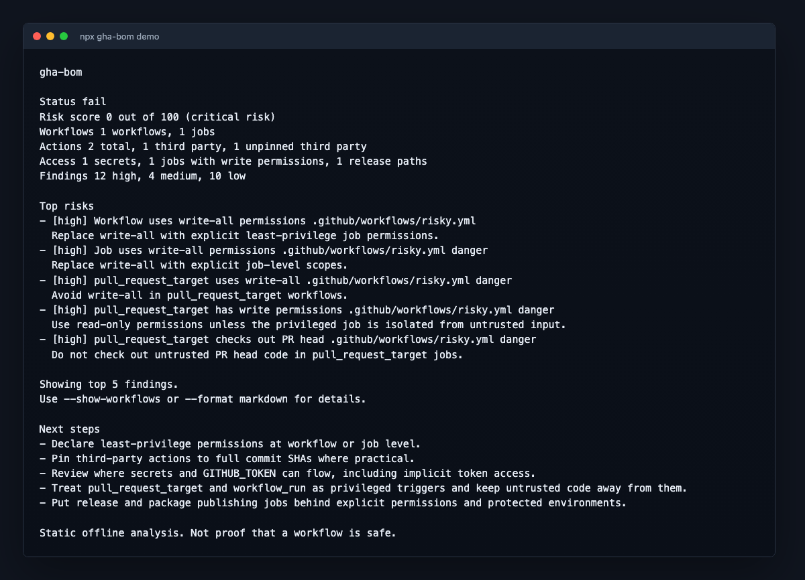

# gha-bom

[](https://github.com/iDogRoag/gha-bom/actions/workflows/ci.yml)
[](https://www.npmjs.com/package/gha-bom)
[](https://www.npmjs.com/package/gha-bom)
[](LICENSE)
[](package.json)

An SBOM for your GitHub Actions workflows.

Generate an offline bill of materials for your GitHub Actions workflows.



gha-bom shows every action, permission, secret reference, trigger, runner,
artifact, cache, and release path your CI/CD depends on. It also diffs reports
so pull requests can show exactly what changed in your workflow attack surface.

Quickstart:

```sh
npx gha-bom scan .
```

Demo:

```sh
npx gha-bom demo
```

```text
gha-bom

Risk score 42 out of 100
Workflows scanned 1
Third party actions 1
Unpinned third party actions 1
Secrets referenced 1
Write permission jobs 1
High findings 5

Top risks

pull_request_target with write-all
Secret passed to unpinned third party action
Self-hosted runner used on pull_request_target
Release path uses mutable action ref
Workflow publishes packages with broad permissions
```

```sh
npx gha-bom demo --format html --output gha-bom-demo.html
```

Preview the demo output:

- Terminal output: [docs/assets/demo-output.txt](docs/assets/demo-output.txt)
- Markdown report: [docs/assets/demo-output.md](docs/assets/demo-output.md)
- HTML report: [docs/assets/demo-report.html](docs/assets/demo-report.html)

More screenshot-friendly samples:

- [Sample risky report](docs/sample-report.md)
- [Sample attack-surface diff](docs/sample-diff.md)
- [Sample HTML report](docs/sample-report.html)

## What is gha-bom

gha-bom shows what your GitHub Actions workflows depend on, what they can
access, and what changed.

It is not just a security scanner. It is a local workflow inventory, risk map,
and diff tool for the CI/CD layer of your supply chain.

## Why this exists

SBOMs usually cover application dependencies, but not the workflows that build
and publish them. GitHub Actions workflows can pull third-party actions, mint
OIDC tokens, publish packages, upload artifacts, use self-hosted runners, and
receive secrets or `GITHUB_TOKEN` access.

gha-bom helps teams see and review that workflow attack surface before it
changes quietly.

## Quickstart

```sh
npx gha-bom scan .
```

For the short alias:

```sh
npx gha-bom scan .
gbom scan .
```

## Demo

The demo works even before you have a repository to scan.

```sh
npx gha-bom demo
npx gha-bom demo --format markdown
npx gha-bom demo --format json
npx gha-bom demo --format html --output gha-bom-demo.html
npx gha-bom demo --badge
```

## Example output

```text
gha-bom

Status fail
Risk score 0 out of 100 (critical risk)
Workflows 1 workflows, 1 jobs
Actions 2 total, 1 third party, 1 unpinned third party
Access 1 secrets, 1 jobs with write permissions, 1 release paths
Findings 12 high, 4 medium, 10 low

Top risks
- [high] Workflow uses write-all permissions
- [high] pull_request_target has write permissions
- [high] Secret passed to unpinned third-party action
- [high] Self-hosted runner used on pull request trigger
- [high] Release path uses unpinned third-party action

Showing top 5 findings.
Use --show-workflows or --format markdown for details.
```

## What it detects

- workflow triggers, permissions, jobs, steps, and runners
- action references, owners, refs, ref types, and mutable refs
- local actions and local reusable workflows
- remote reusable workflows and `secrets: inherit`
- secret references and secret-looking env keys
- `GITHUB_TOKEN` and implicit token exposure through permissions
- OIDC permissions and common cloud auth actions
- artifact upload/download paths
- cache keys and cache paths
- package, container, GitHub release, Pages, and deployment paths
- risky patterns with severity and confidence

## Diff mode

```sh
gha-bom scan . --format json --output current.json
gha-bom diff .gha-bom/baseline.json current.json --format markdown
```

Diff mode detects new workflows, jobs, actions, changed refs, unpinned action
changes, new secret references, widened permissions, new `pull_request_target`
triggers, self-hosted runners, OIDC use, release paths, artifact paths, cache
paths, score changes, and new high findings.

## Explain mode

```sh
gha-bom explain .github/workflows/release.yml
gha-bom explain .github/workflows/ci.yml --format markdown
```

Explain mode focuses the report on one workflow so it is easier to review or
share in an issue.

## GitHub Actions usage

For readability, this example uses major tags. For the strongest
reproducibility, pin third-party actions to full commit SHAs.

```yaml
name: gha-bom

on:
  pull_request:
  push:
    branches:
      - main

permissions:
  contents: read

jobs:
  gha-bom:
    runs-on: ubuntu-latest
    steps:
      - uses: actions/checkout@v6
      - uses: actions/setup-node@v6
        with:
          node-version: 24.x
      - run: npx gha-bom scan . --ci --format markdown --output gha-bom-report.md --fail-on high
      - uses: actions/upload-artifact@v5
        if: always()
        with:
          name: gha-bom-report
          path: gha-bom-report.md
```

## How gha-bom is different

zizmor is a GitHub Actions security linter.
abom maps recursive action dependencies and known compromised actions.
gha-bom is a local workflow inventory and attack surface diff tool.

Use them together.

## Install

gha-bom requires Node.js 24.

```sh
npm install -g gha-bom
gha-bom scan .
```

Local development:

```sh
npm install
npm test
npm run build
node dist/cli.js demo
```

## Configuration

Create a starter config:

```sh
gha-bom init
```

gha-bom looks for `gha-bom.yml`, `gha-bom.yaml`, `.gha-bom.yml`, or
`.gha-bom.yaml`.

```yaml
version: 1
minScore: 80
failOn:
  - high
include:
  - ".github/workflows/*.{yml,yaml}"
exclude: []
risk:
  allowPullRequestTarget: false
  requireExplicitPermissions: true
  requireShaPinnedThirdPartyActions: true
  allowSecretsInPullRequestTarget: false
  allowWriteAll: false
  allowSecretsInThirdPartyActions: false
```

## Report formats

- `table`: compact terminal output
- `json`: stable machine-readable schema
- `markdown`: PR comment-ready report
- `html`: single self-contained report with no external assets

gha-bom can print badge Markdown with `--badge`, but it does not host badges in
v1.

```sh
gha-bom scan . --badge
```

## Risk score

The risk score starts at 100 and subtracts heuristic penalties for risky
patterns such as `pull_request_target` with write permissions, `write-all`,
secrets flowing to unpinned third-party actions, self-hosted runners on pull
request triggers, remote reusable workflows with `secrets: inherit`, release
paths with mutable third-party actions, broad artifact paths, and unnecessary
OIDC permissions.

The score is a prioritization aid, not proof that a workflow is safe.

## Security model

gha-bom is static offline analysis.

Default scan, demo, explain, diff, and report generation do not call the GitHub
API by default, do not make network calls, do not use an advisory database, do
not send telemetry, and do not call AI services.

gha-bom commands do not call the GitHub API by default.

gha-bom reads workflow YAML, optional gha-bom config files, and local composite
action metadata under `.github/actions` when referenced. It records secret
names visible in workflow files, never secret values.

## Limitations

gha-bom does not prove a workflow is safe. It does not verify whether an action
is malicious, verify GitHub owner identity, verify whether a remote ref is
really a branch or tag, verify whether secrets exist in repository settings, or
query branch protection, rulesets, environment protection, or action allow
policies.

It complements tools like zizmor, abom, and GitHub security features. It does
not replace them.

## Roadmap

- Recursive remote action metadata resolution
- Optional GitHub API enrichment
- Known compromised action advisory checks
- CycloneDX output
- SPDX output
- SARIF output
- PR comment mode
- GitHub App
- Organization wide scan
- Baseline management
- Badge hosting
- Integration with zizmor and abom outputs
- Monorepo workflow map
- VS Code extension

## Contributing

See [CONTRIBUTING.md](CONTRIBUTING.md).

### Good first contributions

- Add more workflow risk patterns.
- Improve report formatting.
- Add more test fixtures.
- Improve action reference parsing.
- Add new release path detectors.
- Add docs examples from real workflows.

## License

MIT
